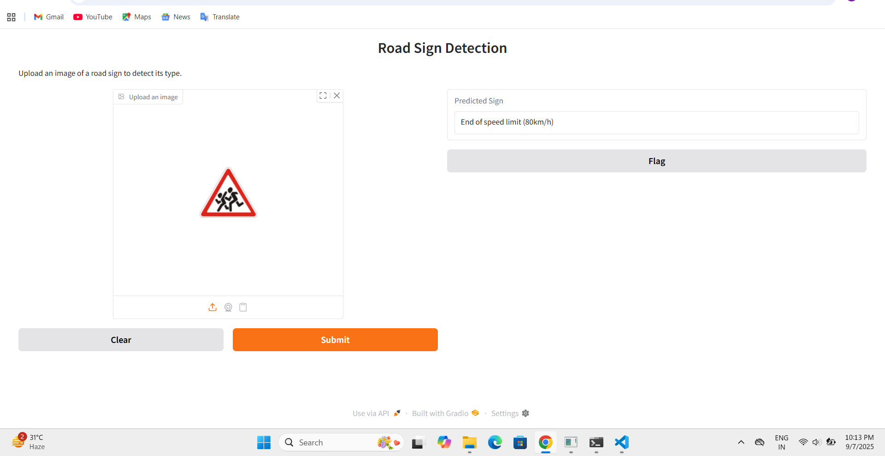

#  Road Signal Detection using CNN

This project focuses on detecting and classifying road traffic signs using a **Convolutional Neural Network (CNN)**.  
It can be useful in building intelligent traffic systems and self-driving cars by automatically recognizing road signals.


##  Project Overview
Road signs are critical for traffic management and road safety.  
The aim of this project is to create a deep learning model that can recognize and classify traffic signs from images into 43 different categories.  

The project includes:
- Training a CNN model (`trainmodel.ipynb`)
- A saved model file (`road_sign_cnn_model.h5`)
- An app interface (`app.py`) built using **Gradio**
- A notebook to test predictions on custom images (`predict_test_image.ipynb`)


##  Dataset
The dataset used is the **German Traffic Sign Recognition Benchmark (GTSRB)**, which contains more than 50,000 images of road signs in 43 classes.  

 Download the dataset from Kaggle:  
[German Traffic Sign Recognition Dataset (Kaggle)](https://www.kaggle.com/datasets/meowmeowmeowmeowmeow/gtsrb-german-traffic-sign)


##  Installation

1. Clone this repository:
   ```bash
   git clone https://github.com/divy686/Road-Signal-Detection.git


2. Navigate to the Project Folder:
     cd road_signal_detection

3. (Optional but recommended) Create a virtual environment:
      conda create -n road python=3.10
      conda activate road

4. Install required dependencies:
      pip install -r requirements.txt


 ##  Usage
 
 1. Train the Model:
       trainmodel.ipynb

 2. Run the App:
     To launch the Gradio interface:
         python app.py
     This will open a web interface where you can upload a road sign image, and the model will predict its category.

 3. Test with Custom Images:
       predict_test_image.ipynb


 ##  Sample Output
 



 


 


